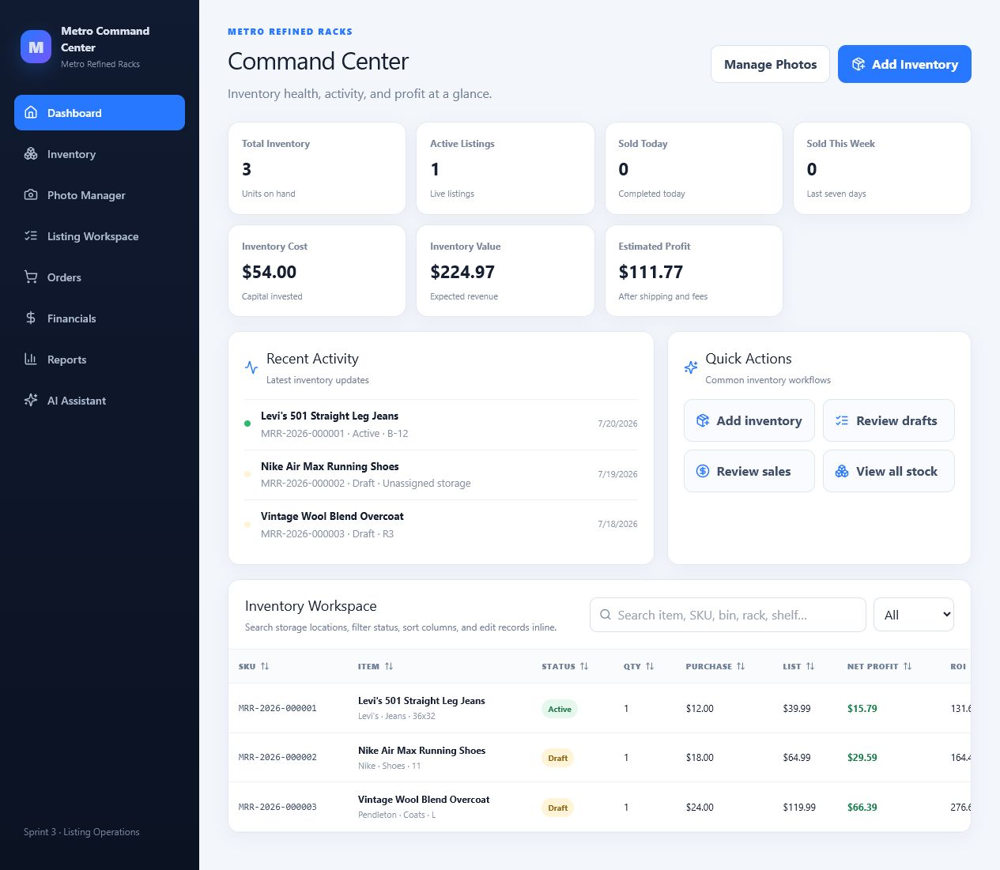

# Metro Command Center

Sprint 4 development adds Business Analytics, session filters, transparent incomplete-data states, and secure CSV exports. See [Sprint 4 Analytics](docs/SPRINT4_ANALYTICS.md).

Metro Command Center is the Windows desktop operations workspace for Metro Refined Racks. Version `0.3.0-rc.1` combines inventory and profit tracking with the Sprint 2 Photo Manager and Sprint 3 Listing Workspace.

## Release candidate features

- Dashboard KPIs, recent activity, quick actions, search, filters, and inline inventory editing.
- Local Photo Manager with multi-file import, previews, ordering, primary-photo selection, and managed offline storage.
- Listing Workspace with a searchable readiness queue, preparation fields, validation warnings, photo context, and Ready to List status.
- Automatic, backward-compatible database migrations and recoverable database writes.
- No native Node dependencies; local persistence uses `sql.js`.



## Install or run

For a testing installation, follow [INSTALL.md](INSTALL.md). For daily workflows, see [USER_GUIDE.md](USER_GUIDE.md). Backup and restore instructions are in [BACKUP.md](BACKUP.md).

Developers need Node.js 22 LTS:

```cmd
npm install
npm run dev
```

Validation and Windows packaging:

```cmd
npm run typecheck
npm test
npm run build
npm run dist:win
```

Application data is stored in Electron's per-user application-data directory, outside the installation directory. Installing an update does not remove that data.

## Release status

This is RC1 for testing, not the final `v0.3.0` release. See [RELEASE_NOTES_v0.3.0.md](RELEASE_NOTES_v0.3.0.md) for limitations and the Windows smoke-test checklist.
